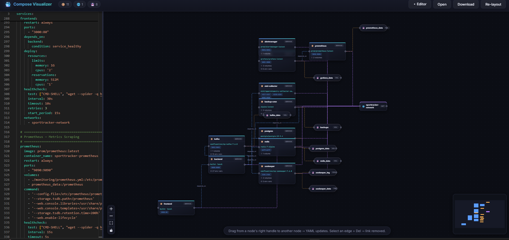
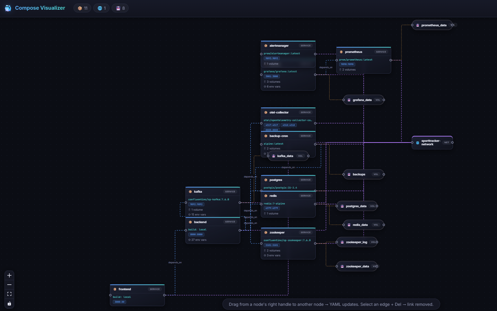
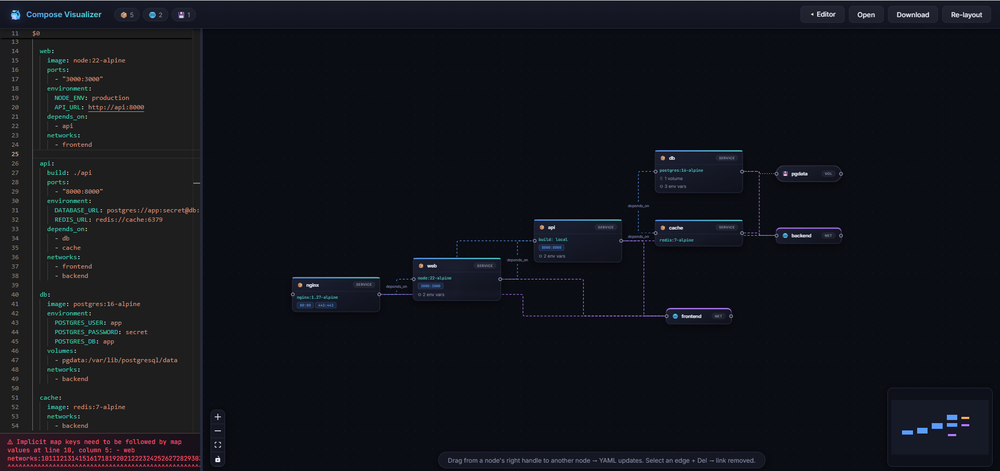
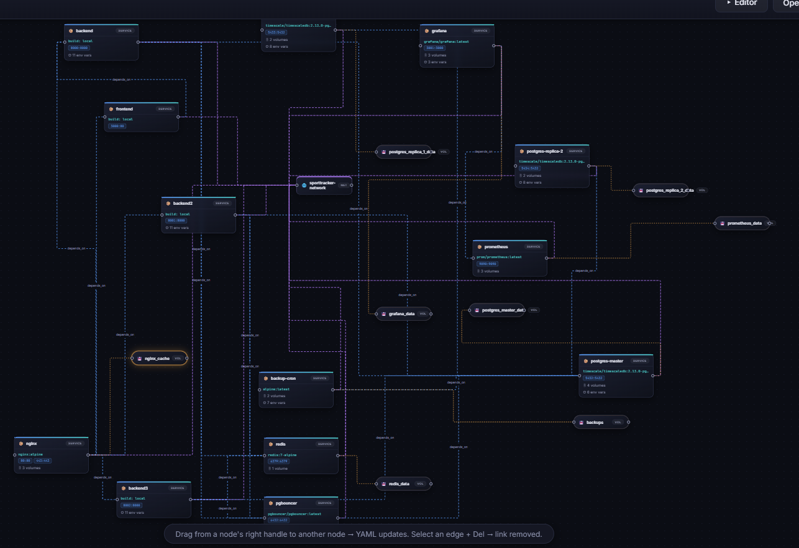

<div align="center">

# 🐳 Docker Compose Visualizer

**Stop scrolling. Start seeing.**

A bidirectional visual editor for `docker-compose.yml` — type YAML on the left,
watch the graph rebuild on the right. Drag connections on the graph, watch the
YAML rewrite itself. Comments and formatting preserved through AST-level edits.

[](LICENSE)


</div>

---

## What is this?

Docker Compose Visualizer is a **local, browser-based tool** that turns your
`docker-compose.yml` files into an interactive graph — and back. It's not a
read-only viewer: you can edit the YAML and watch the graph update in real time,
or drag connections on the graph and watch the YAML rewrite itself.

**No backend. No accounts. No telemetry.** Everything runs locally in your
browser — Monaco editor and Google Fonts load from CDN, but your YAML never
leaves your machine. Open a file, paste some YAML, or drag-and-drop — the tool
does the rest.

### Who is it for?

- **DevOps engineers** managing multi-service compose stacks
- **Developers** onboarding to a project with a complex compose setup
- **Teams** reviewing each other's infrastructure in PRs
- **Anyone** who's tired of scrolling 200 lines of YAML to understand what
  depends on what

---

## The problem

You inherited a `docker-compose.yml` with 15 services, 4 networks, and volumes
everywhere. You're scrolling up and down, drawing arrows on paper, losing track
of what depends on what.

**We've all been there.** Reading 200 lines of YAML to understand topology is
painful. You need a picture — not a file.

## The solution

Paste your compose file. Get an interactive graph instantly:

- **Services** 📦, **networks** 🌐, and **volumes** 💾 as rich custom nodes
- **Two-way sync** — edit YAML → graph follows. Drag a connection → YAML rewrites itself
- **Comments survive** — graph edits mutate the YAML AST, never re-serialize
- **Click any node** → jump straight to its definition in the editor

No more 3 AM arrow-drawing on paper.

---

## ✨ Features

### Live graph with auto-layout

The graph rebuilds in real time as you type (250 ms debounce). Layout is handled
by [dagre](https://github.com/dagrejs/dagre) with **adaptive spacing** — small
graphs spread out for readability, large graphs compact down to fit. Service node
heights are calculated dynamically based on their ports, volumes, and environment
variables, so nodes never overlap.

### True two-way sync

This is the killer feature. Most tools give you a read-only graph. Here, the
graph and the YAML are the **same thing**:

- **Edit YAML** → graph rebuilds in real time
- **Drag a connection** between nodes → `depends_on` / `networks` / `volumes`
  entries are written into the YAML automatically
- **Select an edge + <kbd>Delete</kbd>** → the link is removed from the YAML

The YAML text is the single source of truth; the graph is a derived view. They
can never drift apart because there is only one model.

### Comment-safe AST edits

When you drag a connection or delete an edge, the tool doesn't re-serialize your
YAML with `stringify(parse(text))`. Instead, it parses the document into an AST,
mutates the specific node, and calls `toString()` — **your comments, key order,
and formatting are preserved**. DevOps users care about their YAML formatting,
and so do we.

### Click-to-source navigation

Click any node in the graph and the editor scrolls to its YAML definition,
flash-highlighting the line. No more hunting for `service: api` in a 300-line file.

### Multi-file mode

Working with microservice stacks spread across multiple compose files? Open them
all at once:

- **Services and volumes** are color-coded per file with colored badges
- **Networks** with the same name are merged into shared nodes — so you can see
  how your stacks connect through external networks (the common reverse-proxy
  pattern: one proxy stack + several app stacks sharing a `proxy-net` network)
- Toggle between **Multi** (merged read-only view) and **Single** (per-file
  editing with full two-way sync)
- Hover a file tab to highlight that file's nodes and dim the rest

**Adding files from different folders:** The native file picker can only browse
one folder at a time. Click **Open** once per folder — each selection is *added*
to the existing set, not replaced. You can also **drag and drop** `.yml`/`.yaml`
files anywhere on the app.

**Same-name files:** Many projects use the literal filename
`docker-compose.yml`. If you open two files with the same name but different
content (from different projects), the second one gets a `(2)` suffix instead of
silently overwriting the first. Nothing is ever lost.

### Search / Filter

Type in the search box to dim non-matching nodes by **service name or image**
(e.g. search `postgres` to find every service using a postgres image). Instantly
find what you need in a 30+ node graph. Edges connected to dimmed nodes are
dimmed too, so you can see the relevant subgraph at a glance.

### Validation warnings

The parser detects common Docker Compose mistakes and shows them in an orange
warning bar below the editor — without blocking the graph from rendering:

- **Port conflicts** — two or more services mapping the same host port
- **Dangling network references** — a service uses a network not declared in
  the top-level `networks` section
- **Dangling `depends_on`** — a service depends on another service that doesn't
  exist in the same file
- **Dangling volume references** — a service mounts a named volume not declared
  in the top-level `volumes` section (bind mounts like `./`, `../`, `/`, `~/`
  are correctly excluded)

### Import from URL

Paste a GitHub raw or blob URL to load a compose file directly — great for
reviewing someone else's repo without cloning. Blob URLs are automatically
converted to raw URLs.

### Export as PNG

One click to download the graph as a PNG image for Slack, PRs, or documentation.
The export clones the React Flow viewport, inlines all computed styles, and
rasterizes via SVG `foreignObject` + canvas — no external dependencies, pure
browser APIs. If the export fails (some browsers block canvas operations), you
get a clear error message instead of silent failure.

### Crash-resistant

An `ErrorBoundary` around the graph means a crash kills the graph, not the
editor. Fix the YAML → the graph rebuilds automatically. You never lose your
work because of a parse error.

### Cross-platform

Works on **Windows, Linux, and macOS** with any modern browser. Keyboard
shortcuts use physical key codes (`e.code`), so `Ctrl+B` works regardless of
your keyboard layout (Cyrillic, AZERTY, Dvorak — doesn't matter). On macOS,
`Cmd+B` is supported too.

### Quality-of-life details

- **Collapsible editor** — toggle via toolbar button, <kbd>Ctrl+B</kbd>
  (<kbd>Cmd+B</kbd> on macOS), or double-click the splitter. Drag all the way
  left to auto-collapse
- **Persistent UI state** — editor width and collapsed state survive reloads
  via `localStorage` (debounced writes, error-proofed for Safari private browsing)
- **Drag-and-drop** — drop `.yml`/`.yaml` files anywhere on the app to add them
- **Open / Download** — load any compose file, export the edited result
- **Dark mode only.** Obviously.

---

## 📸 Screenshots









---

## 🚀 Quick start

### One-click launch

**Windows** — double-click `start.bat`

**Linux / macOS:**

```bash
chmod +x start.sh && ./start.sh
```

Both scripts check for Node.js, install dependencies on first run, open the
browser, and start the dev server at `http://localhost:5173`.

### Manual

```bash
npm install     # install dependencies (once)
npm run dev     # dev server → http://localhost:5173
npm run build   # type-check + production build → dist/
npm run preview # serve the production build locally
```

Requires **Node.js ≥ 18** and any modern browser (Chrome, Edge, Firefox, Safari).

---

## 🖱 Usage

### Basic editing

1. Paste or **Open** your `docker-compose.yml` in the left pane
   (or **drag-and-drop** a file onto the app)
2. Edit text — the graph follows in real time
3. Click any node — the editor scrolls to its YAML definition

### Graph → YAML (drag connections)

Drag from a node's **right handle** (●) to another node:

| Connection            | YAML result                          |
| --------------------- | ------------------------------------ |
| service → service     | adds `depends_on` entry              |
| service → network     | adds entry under `networks`          |
| service → volume      | adds a `volumes` mount               |

### YAML → Graph (delete edges)

Select an edge in the graph and press <kbd>Delete</kbd> (or <kbd>Backspace</kbd>)
— the link is removed from the YAML.

### Multi-file workflow

1. Click **Open** and select a `.yml` file from one folder
2. Click **Open** again, navigate to another folder, select another file —
   it's added to the existing set, not replaced
3. Or just **drag-and-drop** files from multiple Explorer/Finder windows
4. Toggle **🔗 Multi / 🔗 Single** to switch between merged view and per-file editing
5. Hover a file tab to highlight that file's nodes

### Other actions

- **Re-layout** — re-run dagre auto-layout (clears manual node positions)
- **Download** — export the current YAML to a file
- **📷 PNG** — export the graph as a PNG image
- **URL bar** — paste a GitHub raw/blob URL to import a compose file

---

## 🏗 Architecture

The YAML text is the **single source of truth**; the graph is a derived view.
Every graph interaction (drag connection, delete edge) is translated into an
AST-level text edit, then the graph is rebuilt from the new text — so the two
views can never drift apart.

```
 ┌────────────┐   parse (debounced 250ms)   ┌────────────┐
 │  YAML text │ ──────────────────────────► │   Graph    │
 │  (Monaco)  │                             │ (ReactFlow)│
 └────────────┘ ◄────────────────────────── └────────────┘
              AST edit (addLink / removeLink)
```

### Key design decisions

- **AST edits, not re-serialization** — graph→YAML edits mutate the `yaml`
  document tree and call `toString()`, preserving comments, key order, and
  formatting. Never `stringify(parse(text))`.
- **Stable deterministic IDs** — every node and edge has a predictable ID
  (`service:api`, `network:backend`, `dep:nginx->api`) so graph elements map
  back to exact YAML locations.
- **File-scoped multi-file mode** — services and volumes are prefixed with a
  file index (`service:0#api`) to prevent collisions. Networks are merged by
  name. This models independently-run compose projects connected through
  `external: true` networks — not `docker-compose -f a.yml -f b.yml` deep-merge.
- **Crash isolation** — an `ErrorBoundary` around the graph subtree catches
  parse errors and rendering crashes. The editor stays functional; fix the YAML
  and the graph rebuilds.

Full technical details: [`docs/ARCHITECTURE.md`](docs/ARCHITECTURE.md)

---

## 🧰 Stack

| Concern        | Library                                                |
| -------------- | ------------------------------------------------------ |
| UI             | React 18 + TypeScript + Vite                           |
| Graph          | [React Flow 11](https://reactflow.dev)                 |
| Editor         | [Monaco](https://microsoft.github.io/monaco-editor/)   |
| YAML AST       | [yaml](https://eemeli.org/yaml/)                       |
| Auto-layout    | [dagre](https://github.com/dagrejs/dagre)              |

**No backend, no server, no database.** Monaco editor loads from CDN (via
`@monaco-editor/react`'s built-in loader); everything else is bundled. Google
Fonts are loaded from `fonts.googleapis.com`. No telemetry, no accounts.

---

## 📁 Project structure

```
├── src/
│   ├── App.tsx                    # State, two-way sync, toolbar, split layout
│   ├── lib/parser.ts              # YAML↔graph: parse, layout, add/remove links
│   ├── components/
│   │   ├── nodes.tsx              # Custom ReactFlow nodes (memoized)
│   │   └── ErrorBoundary.tsx      # Catches graph crashes, keeps editor alive
│   ├── sample.ts                  # Demo compose file shown on first load
│   └── styles.css                 # Dark theme, node & edge styling
├── docs/ARCHITECTURE.md           # Full technical documentation
├── start.bat                      # Windows launcher
├── start.sh                       # Linux / macOS launcher
└── package.json
```

---

## 🤝 Contributing

PRs welcome. Keep the core rule intact: *never* re-serialize YAML with
`stringify(parse(text))` — all text edits must go through the `yaml` document
AST to preserve user comments and formatting.

See [`docs/ARCHITECTURE.md`](docs/ARCHITECTURE.md) for extension points (new
node kinds, new edge semantics, editor↔graph highlighting).

---

## 📄 License

[MIT](LICENSE)
